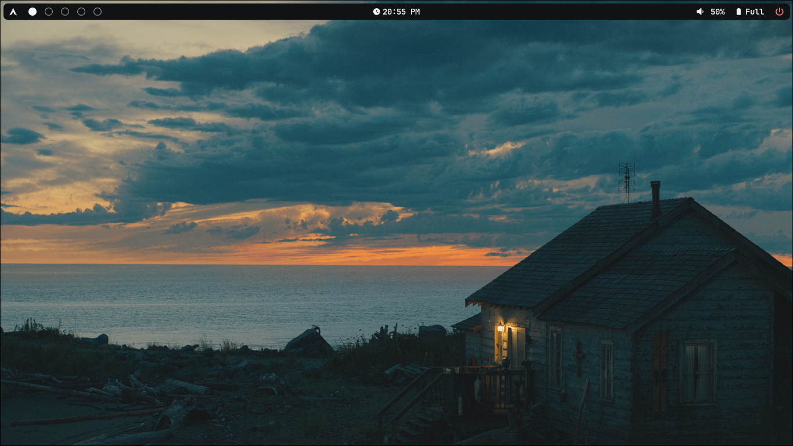
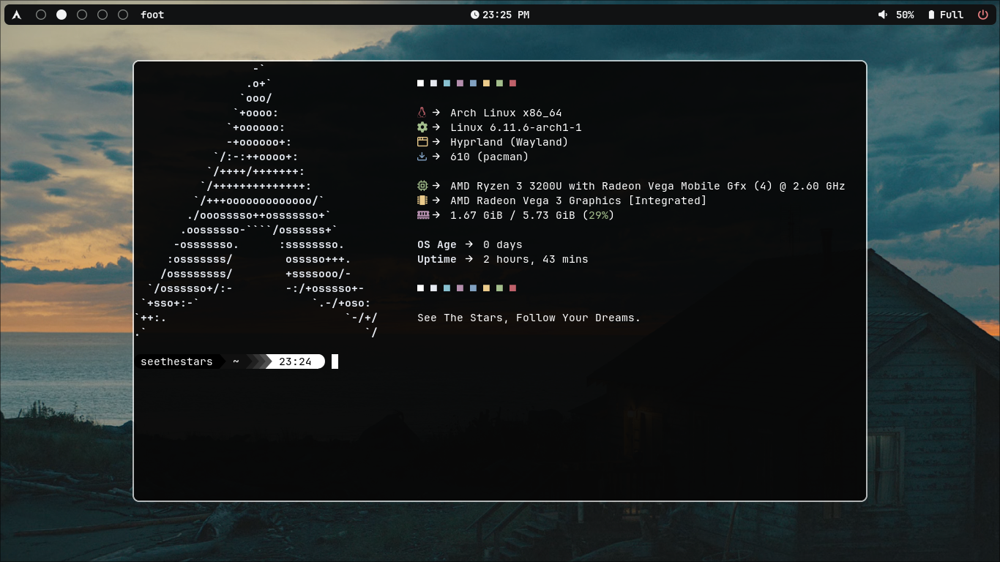

<div align="center">





</div>

<!-- Installation Instructions -->
## Hyprland Setup

To install and set up the Hyprland dotfiles, follow these steps:

<small> 

> **Note:** The hyprland.sh works better using a minimal install of Arch Linux using the archinstall script.

</small>

1. Clone the repository:

    ```sh
    git clone https://github.com/seethastars/dotfiles.git
    ```

2. Change to the repository directory:

    ```sh
    cd dotfiles/
    ```
    
3. Run the install script:

    ```sh
    ./hyprland.sh
    ```

## Keybinds

<div align="center">

| Mapping                 | Action                                           |
| ----------------------- | ------------------------------------------------ |
| `Super + Return`        | Open Terminal (Foot)                             |
| `Super + Q`             | Close Window                                     |
| `Super + W`             | Open Web Browser - (Librewolf)                   |
| `Super + E`             | Open File Manager - (Thunar)                     |
| `Super + R`             | Open App Launcher - (Rofi)                       |
| `Super + L`             | Exec lockscreen - (Hyprlock)                     |
| `Super + B`             | Restart Waybar                                   |
| `Super + N`             | Change Wallpaper                                 |
| `Super + M`             | Exit Hyprland                                    |

<small>

**Note:** The hyprland dots are **Work in Progress** (WIP).

</small>

</div>
