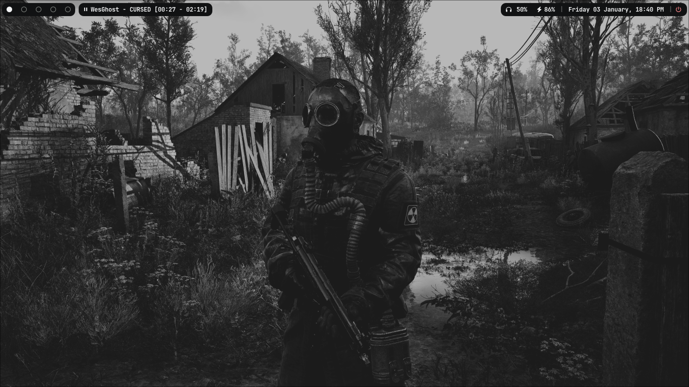

<div align="center">



</div>

<!-- Installation Instructions -->
## Hyprland Setup

To install and set up the Hyprland dotfiles, follow these steps:

<small> 

> **Note:** I use the hyprland.sh script after a minimal install of Arch Linux using archinstall.

</small>

1. Clone the repository:

    ```sh
    git clone https://github.com/seethastars/dotfiles.git
    ```

2. Change to the repository directory:

    ```sh
    cd dotfiles/
    ```
    
3. Run the install script:

    ```sh
    ./setup.sh
    ```
