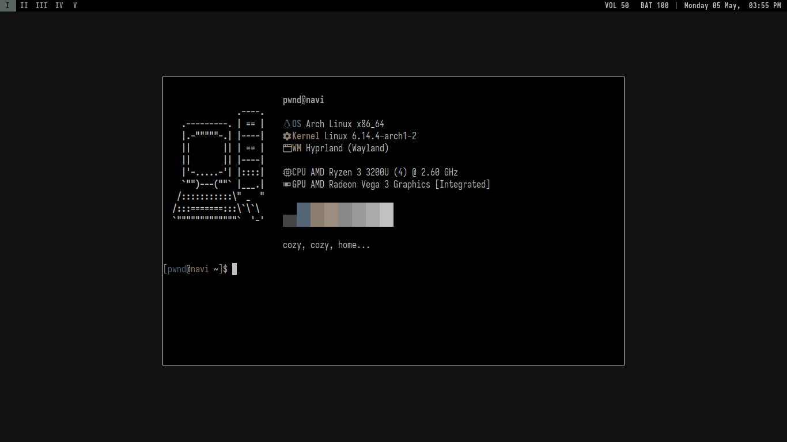

# Dotfiles

- OS: [Arch Linux](https://archlinux.org)
- WM/Compositor: [Hyprland](https://hyprland.org/)
- Terminal: [foot](https://codeberg.org/dnkl/foot)
- Menu: [fuzzel](https://codeberg.org/dnkl/fuzzel)
- Text Editor: [neovim](https://neovim.io/)
- Video Player: [mpv](https://mpv.io/)
- Music Player: [cmus](https://github.com/cmus/cmus)
- Browser: [Librewolf](https://librewolf.net/)
- Colorscheme: [base16-black-metal-colorscheme](https://github.com/metalelf0/base16-black-metal-scheme)

